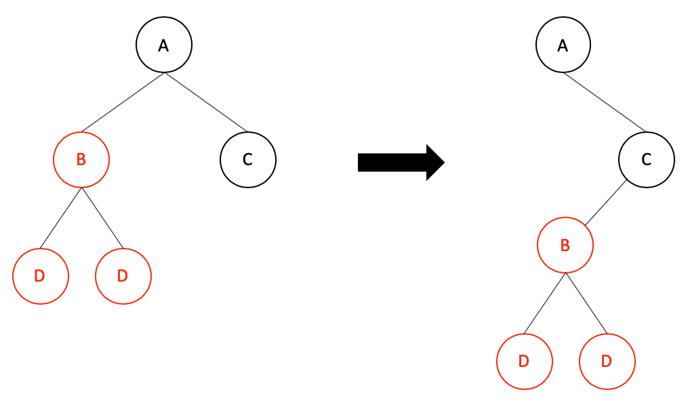
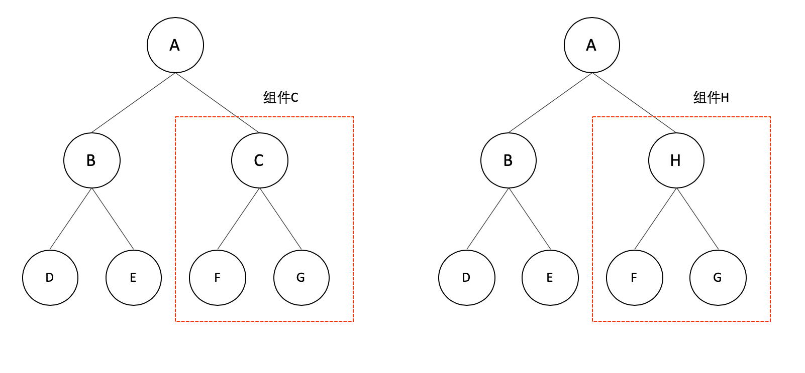
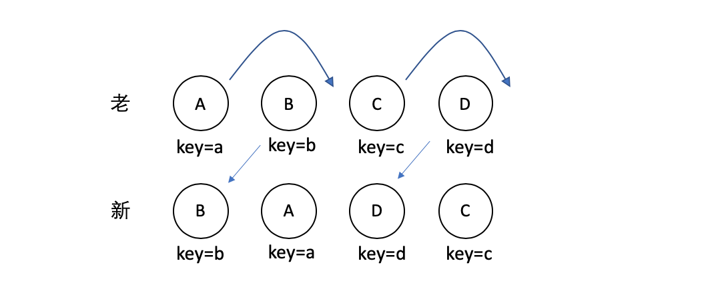

# React 中的 diff 算法

### React diff 策略

* 同层级 diff 比较，不同层级即使节点不同也不复用

* 不同类型组件即使结构类似也不复用

* element diff ，通过遍历children，查找可复用子节点


下面重点讲一下element diff 

### Situation

element diff 涉及四种场景:

* 节点更新
* 节点增加
* 节点删除
* 节点移动

#### 节点更新

当节点可复用时，会使用新节点的 props 更新老节点，使用更新过的老节点而不重新创建新节点

```js
// old A -> B
<p className={'red'} key = {'1'}>11</p>
<p className={'blue'} key = {'2'}>22</p>

// new A -> B
<p className={'red'} key = {'1'}>11</p>
<p className={'blue-add'} key = {'2'}>22</p>

// old
// A -> B

// new
// A -> B
```

上述例子中，虽然 className 改变了，但是节点可以复用，只是更新 props

#### 节点增加

```js
// old
// A -> B -> C -> D

// new
// A -> B -> C -> D -> E

```
上述中 A B C D 四个节点都可以复用，只需要新增 E 节点

#### 节点删除

```js
// old
// A -> B -> C -> D

// new
// A -> B -> C
```

#### 节点移动

```js
// old
// A -> B -> C -> D

// new
// A -> B -> D -> C
```

上述情况中，C D 是可以被复用的，但是我们需要进行移动操作。

在实际情况中，一定不是单纯的更新、增加、删除、移动，大多数情况都是这四种情形的组合，在 react 中，通过 `reconcileChildrenArray` 方法进行 diff ，下面通过一个例子来看看 `reconcileChildrenArray`

#### reconcileChildrenArray

```js
// old A -> B -> C -> D -> E

// new A -> B -> F -> D -> C
```
* Step 1

首先 react 会对新节点循环遍历，通过 `updateSlot` 初步判断是否可以复用，并进行节点更新；

当我们遍历 D 节点时，发现不可复用，此时会跳出循环；


```js
// step 1
for (; oldFiber !== null && newIdx < newChildren.length; newIdx++) {
  if (oldFiber.index > newIdx) {
    nextOldFiber = oldFiber;
    oldFiber = null;
  } else {
    nextOldFiber = oldFiber.sibling;
  }
  const newFiber = updateSlot(
    returnFiber,
    oldFiber,
    newChildren[newIdx],
    lanes,
  );
  if (newFiber === null) {
    if (oldFiber === null) {
      oldFiber = nextOldFiber;
    }
    break;
  }
  if (shouldTrackSideEffects) {
    if (oldFiber && newFiber.alternate === null) {
      deleteChild(returnFiber, oldFiber);
    }
  }
  lastPlacedIndex = placeChild(newFiber, lastPlacedIndex, newIdx);
  if (previousNewFiber === null) {
    resultingFirstChild = newFiber;
  } else {
    previousNewFiber.sibling = newFiber;
  }
  previousNewFiber = newFiber;
  oldFiber = nextOldFiber;
}
```

* Step 2

这时候我们的 old 和 new 的情况为：

```js
// old C -> D -> E

// new F -> D -> C
```

这个时候 old 和 new 都不为空，react 会通过 `mapRemainingChildren` 方法为 old 建立一个 叫做 `existingChildren` 的 Map 对象。

```js
const existingChildren = mapRemainingChildren(returnFiber, oldFiber);
```

* Step3 

继续遍历 new 中剩余节点,此时 react 会向 existingChildren 中查找新节点是否存在，存在即可复用，不存在即创建;

当我们遍历到 F 节点时，existingChildren 中不存在 F ，则创建一个新的 F；

当遍历到 D 时，existingChildren 中存在 D, 则取出，但是我们如何判断 D 是否移动呢；

react 通过 lastPlacedIndex 记录了当前已经复用的最后一个节点的 index ，此时我们当前已经复用的最后一个节点是 B，lastPlacedIndex 为 1，当我们需要判断 D 是否需要移动时，我们通过 D 的 index 和 lastPlacedIndex 对比，发现 D.index(3) > lastPlacedIndex(1),证明 D 原本就在 B 的右边，则不移动，此时更新 lastPlacedIndex = 3，并将 D 从 existingChildren 中删除；

当遍历到 C 时，existingChildren 中存在 C，则取出，此时 lastPlacedIndex 为 3，C 的 index 为 2，我们发现 C 以前应该在 D 的左边， 此时我们需要移动 C ，此时更新 lastPlacedIndex = 2，并将 C 从 existingChildren 中删除；


```js
for (; newIdx < newChildren.length; newIdx++) {
  const newFiber = updateFromMap(
    existingChildren,
    returnFiber,
    newIdx,
    newChildren[newIdx],
    lanes,
  );
  if (newFiber !== null) {
    if (shouldTrackSideEffects) {
      if (newFiber.alternate !== null) {
        existingChildren.delete(
          newFiber.key === null ? newIdx : newFiber.key,
        );
      }
    }
    lastPlacedIndex = placeChild(newFiber, lastPlacedIndex, newIdx);
    if (previousNewFiber === null) {
      resultingFirstChild = newFiber;
    } else {
      previousNewFiber.sibling = newFiber;
    }
    previousNewFiber = newFiber;
  }
}
```

Step4

此时新节点已经遍历结束，我们将 existingChildren 中剩余老节点删除;

并返回 diff 的结果： `resultingFirstChild`  A -> B -> F -> D -> C

```js
if (shouldTrackSideEffects) {
  existingChildren.forEach(child => deleteChild(returnFiber, child));
}

return resultingFirstChild;
```


### Questions

* **Q1**

```js
function FunctionComponent(props) {
  const [state,dispatch] = useReducer(reducer, initState);
  const setShow = function() {
    dispatch({type: 'setShow'})
  }
  
  return (
    <div className="border">
      <p>{props.name}</p>
      <p>this is function component</p>
      {
        state.show ? 
          <h5>show</h5> :
          <p>not show</p>
      }
      <button onClick={setShow}>setShow</button>
    </div>
  );
}

/////// diff ////////////////////////////////////////////////////////////////////////////////////
// Step 1 
for (; oldFiber !== null && newIdx < newChildren.length; newIdx++) {
  if (oldFiber.index > newIdx) {
    nextOldFiber = oldFiber;
    oldFiber = null;
  } else {
    nextOldFiber = oldFiber.sibling;
  }
  const newFiber = updateSlot(
    returnFiber,
    oldFiber,
    newChildren[newIdx],
    lanes,
  );
  console.log('oldFiber=>', oldFiber);
  console.log('newFiber=>', newFiber);
  if (newFiber === null) {
    // TODO: This breaks on empty slots like null children. That's
    // unfortunate because it triggers the slow path all the time. We need
    // a better way to communicate whether this was a miss or null,
    // boolean, undefined, etc.
    if (oldFiber === null) {
      oldFiber = nextOldFiber;
    }
    break;
  }
  if (shouldTrackSideEffects) {
    if (oldFiber && newFiber.alternate === null) {
      // We matched the slot, but we didn't reuse the existing fiber, so we
      // need to delete the existing child.
      deleteChild(returnFiber, oldFiber);
    }
  }
  lastPlacedIndex = placeChild(newFiber, lastPlacedIndex, newIdx);
  if (previousNewFiber === null) {
    // TODO: Move out of the loop. This only happens for the first run.
    resultingFirstChild = newFiber;
  } else {
    // TODO: Defer siblings if we're not at the right index for this slot.
    // I.e. if we had null values before, then we want to defer this
    // for each null value. However, we also don't want to call updateSlot
    // with the previous one.
    previousNewFiber.sibling = newFiber;
  }
  previousNewFiber = newFiber;
  oldFiber = nextOldFiber;
}

```

* **Q2**

```js

// 当出现如下情况

// old : A B C D
// new : A B E D C

// STEP 1 复用 A B , 此时 lastPlacedIndex = 1

// 剩余 old : C D
// 剩余 new : E D C

// STEP 2 将剩余 old 存入 existingChildren 中，遍历 E D C
// 在 existingChildren 中未查找到 E 节点，创建新的 E ，放入 resultingFirstChild 尾部 此时 lastPlacedIndex = 1
// 在 existingChildren 中查找到 D 节点，判断不需要移动，删除 existingChildren 中的 D ，将取出的 D 放入 resultingFirstChild 尾部 此时 lastPlacedIndex = 3
// 在 existingChildren 中查找到 C 节点，判断需要移动，C 的 index(2) 小于 lastPlacedIndex(3) ,  删除 existingChildren 中的 C ，将取出的 C 放入 resultingFirstChild 尾部 此时 lastPlacedIndex = 2

```

> 为何需要判断 C 是否需要移动，从 existingChildren 中取出，直接加入 resultingFirstChild中不行吗