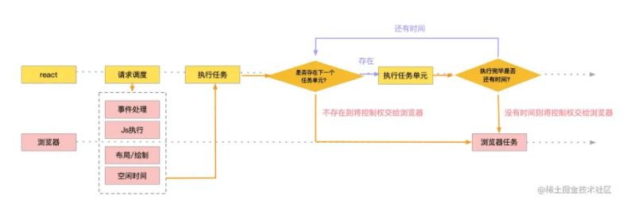
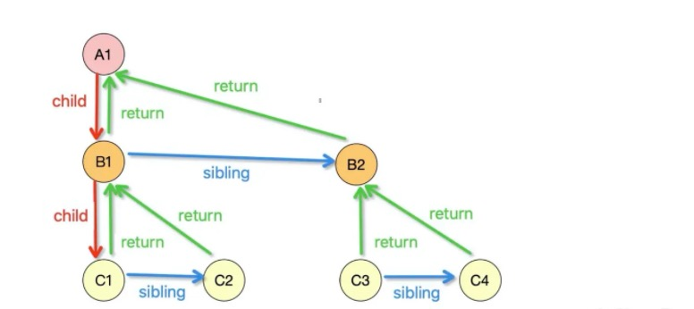

# Fiber

在 react16 引入 Fiber 架构之前，react 会采用递归对比虚拟DOM树，找出需要变动的节点，然后同步更新它们，这个过程 react 称为reconcilation（协调）。在reconcilation期间，react 会一直占用浏览器资源，一旦虚拟DOM树深度很大，在递归的过程中，执行栈会越来越深，变得十分卡顿，而且不能中断，中断后就不能恢复了。如果递归花了100ms，则这100ms浏览器是无法响应的，代码执行时间越长卡顿越明显。传统的方法存在不能中断和执行栈太深的问题。

因此，为了解决以上的痛点问题，React希望能够彻底解决主线程长时间占用问题，于是引入了 Fiber 来改变这种不可控的现状，把渲染/更新过程拆分为一个个小块的任务，通过合理的调度机制来调控时间，指定任务执行的时机，从而降低页面卡顿的概率，提升页面交互体验。通过Fiber架构，让reconcilation过程变得可被中断。适时地让出CPU执行权，可以让浏览器及时地响应用户的交互。

React16中使用了 Fiber，但是 Vue 是没有 Fiber 的，为什么呢？原因是二者的优化思路不一样：

1. Vue 是基于 template 和 watcher 的组件级更新，把每个更新任务分割得足够小，不需要使用到 Fiber 架构，将任务进行更细粒度的拆分
2. React 是不管在哪里调用 setState，都是从根节点开始更新的，更新任务还是很大，需要使用到 Fiber 将大任务分割为多个小任务，可以中断和恢复，不阻塞主进程执行高优先级的任务

### 什么是Fiber

React 将虚拟DOM树上的每一个虚拟DOM转化成一个个 Fiber，作为一个个执行任务单元，这些一个个 Fiber 通过单链表的方式彼此产生相应的关联。

Fiber与浏览器的核心交互如下：



首先 React 向浏览器请求调度，浏览器在一帧中如果还有空闲时间，会去判断是否存在待执行任务，不存在就直接将控制权交给浏览器，如果存在就会执行对应的任务，执行完成后会判断是否还有时间，有时间且有待执行任务则会继续执行下一个任务，否则就会将控制权交给浏览器。

Fiber 可以被理解为划分一个个更小的执行单元，它是把一个大任务拆分为了很多个小块任务，一个小块任务的执行必须是一次完成的，不能出现暂停，但是一个小块任务执行完后可以移交控制权给浏览器去响应用户，从而不用像之前一样要等那个大任务一直执行完成再去响应用户。


### Fiber 的表现形式

Fiber 是采用链表实现的。每个 Virtual DOM 都可以表示为一个 fiber，如下图所示，每个节点都是一个 fiber。一个 fiber包括了 child（第一个子节点）、sibling（兄弟节点）、return（父节点）等属性，React Fiber 机制的实现，就是依赖于以下的数据结构。




### Fiber 的节点结构

```js
{
  type: any, // 对于类组件，它指向构造函数；对于DOM元素，它指定HTML tag
  key: null | string, // 唯一标识符
  stateNode: any, // 保存对组件的类实例，DOM节点或与fiber节点关联的其他React元素类型的引用
  child: Fiber | null, // 大儿子
  sibling: Fiber | null, // 下一个兄弟
  return: Fiber | null, // 父节点
  tag: WorkTag, // 定义fiber操作的类型
  nextEffect: Fiber | null, // 指向下一个节点的指针
  updateQueue: mixed, // 用于状态更新，回调函数，DOM更新的队列
  memoizedState: any, // 用于创建输出的fiber状态
  pendingProps: any, // 已从React元素中的新数据更新，并且需要应用于子组件或DOM元素的props
  memoizedProps: any, // 在前一次渲染期间用于创建输出的props
  // ……     
}
```

### Fiber 任务执行

从根节点开始渲染和调度的过程可以分为两个阶段：render 阶段、commit 阶段。

* render 阶段：这个阶段是可中断的，会找出所有节点的变更
* commit 阶段：这个阶段是不可中断的，会执行所有的变更

#### render 阶段

此阶段会找出所有节点的变更，如节点新增、删除、属性变更等。

此阶段可以随时中断。

#### commit 阶段

commit 阶段将render阶段处理的 Fiber 链表转化成一个个真实的 dom 节点，并挂载到相应的位置。

此阶段不可中断。